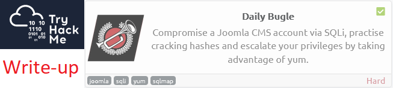
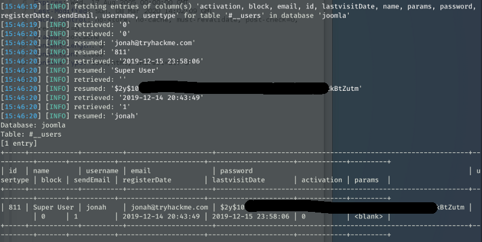
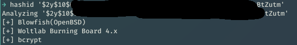
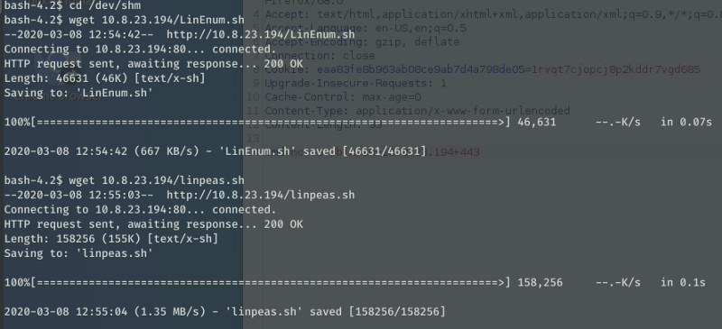

# Write-up: Daily Bugle @ TryHackMe



This write-up for the room *Daily Bugle* is part of my walk-through series for [TryHackMe](https://tryhackme.com).

Lab-Link: <https://tryhackme.com/room/dailybugle>  
Room type: Free
Difficulty: Hard

## Steps

### Basic enumeration

I start the lab with a nmap scan to find open ports on the machine.

```
nmap -nv -Pn -sC -sV -O -T4 -oA nmap 10.10.123.253
```

The options I use are the following:

| Option | Meaning | Reasoning |
| -- | -- | -- |
| -n | No DNS resolution | Makes no sense in the lab and slows down |
| -v | Verbose | Print open ports as soon as they are found |
| -Pn | No ping scan | In the lab, I assume the target is online | 
| -sC | Use default set of scripts | Note: This includes some intrusive scans, on a CTF box this is fine, in a real-world scenario using `--script=safe` is preferred |
| -sV | Version detection | Attempt to enumerate the versions for services found | 
| -O | OS detection | |
| -T4 | Use aggressive timing | Another option that is fine in CTF environments but can cause issues in the real world |
| -oA | Output all formats | I'd like to have all formats stored: nmap, xml and grepable |


The results come back showing just three ports open:

- SSH on port 22.
  Often not worth looking too deep inside as long as there are other avenues.
- A webserver on port 80.
  Webservers usually go straight to the top of the priority list.
  It also shows the exact version of apache, that it runs a Joomla page and an indication of the operating system of the server.
- A MySQL server on port 3306
  Often, the database listens on localhost only. An open port to the outside world might indicate a misconfiguration, and if there is one there might be more.

Unfortunately, the OS detection came back inconclusive. Therefore the hint of the web server is to be taken with a pinch of salt.

Background scans for full TCP and top 1000 UDP did not show any more ports open.


The UDP scan of the TOP-1000 ports did show a couple of open|filtered, but nothing that is open or looks interesting.


---

### Checking the application

Looking at the website it shows a typical blog. Nmap showed it as joomla, so I perform a scan with joomscan to find out more information, which also includes checking the robots.txt:

```
joomscan -u http://10.10.123.253
```


Here I find the joomla version that is used (3.7.0) as well as a few other information. A check with searchsploit shows that this version is vulnerable to SQL injection.


---

### Attacking the database

The description of the exploit shows how this vulnerability can be abused with sqlmap. I run it with the arguments provided:

```
sqlmap -u “http://10.10.123.253/index.php?option=com_fields&view=fields&layout=modal&list[fullordering]=updatexml" --risk=3 --level=5 --random-agent --dbs -p list[fullordering]
```

This leads to an enumeration of the existing databases:


The interesting things are user credentials of joomla, so let sqlmap dump these. The table name can be either taken out of the information_schema, or simply by checking the joomla documentation (https://docs.joomla.org/Tables/users)

```
sqlmap -u "http://10.10.123.253/index.php?option=com_fields&view=fields&layout=modal&list[fullordering]=updatexml" --risk=3 --level=5 --random-agent -D joomla -T '#__users' --dump
```

Unfortunately, it is not as easy as hoped, sqlmap is unable to retrieve the columns:


I can now use the wordlist check to find columns (abort run after the interesting fields are available):


As an alternative, I can check the joomla documentation and state the columns individually:

```
sqlmap -u "http://10.10.123.253/index.php?option=com_fields&view=fields&layout=modal&list[fullordering]=updatexml" --risk=3 --level=5 --random-agent -D joomla -T '#__users' -C id,name,username,email,password,usertype,block,sendEmail,registerDate,lastvisitDate,activation,params --dump
```



---

### Breaking the hash

From the database, I got a username (`jonah`) and the corresponding password hash. It starts with `$2y$`, which means it is a bcrypt hash (see also http://pentestmonkey.net/cheat-sheet/john-the-ripper-hash-formats).

I verify this assumption with hashid:



With the help of [john](https://github.com/openwall/john) and the trusty [rockyou.txt](https://github.com/brannondorsey/naive-hashcat/releases/download/data/rockyou.txt), the password is easily revealed.

```
john cred --wordlist=/usr/share/wordlists/rockyou.txt --format=bcrypt
```


---

### Getting a foothold

Now that valid credentials are known, I quickly check whether these credentials are reused for a system user as well. Quickly trying to ssh in with jonah and root show that this is not the case though.

With the newly minted credentials, I log into the application at http://10.10.123.253/administrator/index.php

The web interface confirms that jonah is a superuser of the joomla installation.


This means I can edit the template used by the blog. I like the web shell shown by [ippsec](https://www.youtube.com/channel/UCa6eh7gCkpPo5XXUDfygQQA) in some of his videos.


Now quickly verify that it works by opening it in the browser:


---

### Improving the usability

It is time to get better handling of the requests without having to modify the URL all the time. 

I find the request in Burp Proxy, send it to Repeater and change the message type to POST.

Now I verify that it still works:


---

### Obtaining shell access

Next, I create a ncat listener with `ncat -nvlp 443` and change the command in burp to execute a reverse shell with netcat. Don't forget to urlencode it, otherwise, it will not work.


On some machines, the openbsd version of nc is installed. That version does not support the -e argument, the command above will fail and I have to use another reverse shell. On this box this is not the case, once I send the command I get a callback:


To get a proper shell, I do a shell upgrade with python and ensure everything is sent to the reverse side. Please note that I did not type the `ncat -nvlp 443` command shown in the screenshot, instead I typed fg which is not echo'ed back here to get back to the reverse shell.


Now the shell is working properly with all features that are expected by a shell, namely tab completion and, most importantly, an interrupt handling so Ctrl-C does not throw me out of the system.

---

### Local enumeration

Let's see if I can straight away look into a user home directory, but unfortunately, they are configured correctly. I keep a note of the username though.


There are two nice local enumeration scripts that I like:

- [LinEnum](https://medium.com/r/?url=https%3A%2F%2Fgithub.com%2Frebootuser%2FLinEnum)
- [linPEAS](https://medium.com/r/?url=https%3A%2F%2Fgithub.com%2Fcarlospolop%2Fprivilege-escalation-awesome-scripts-suite)

So I get both and copy them to the target. I use [updog](https://github.com/sc0tfree/updog) instead of the more popular SimpleHTTPServer as it allows both easy upload and download of files to and from the target:


On the target side, I go to /dev/shm to store these files temporarily:



I call the scripts and exfiltrate the results straight away


The LinEnum result does not show anything immediately obvious, the linpeas result, however, has found a suspicious entry:


---

### Getting user access

Now I try this password with the username found in /home, jjamesson.


This is a success which means I can go for the user flag


Let's find out if jjameson is allowed to do something as another user:


---

### Going for root

Yes, he is allowed to call yum as root. Now check whether there is a known escalation route for yum in combination with sudo on https://gtfobins.github.io/gtfobins/yum/. It turns out that yes, loading a custom plugin can be used to spawn a root shell.

Simply copy and paste the example code from gtfobin in the shell is enough in this case.


All that is left now is to get the root flag:


---

### Conclusion

The box is fairly straightforward, with the difficult part upfront: Getting the credentials for joomla.

What I do not understand, however, is that it is part of the OSCP learning path as the usage of sqlmap is not allowed during the OSCP exam.

Getting the joomla credentials without sqlmap is still possible, but much more complex to use and likely goes beyond the SQL injections present in that exam.

Still, overall it is a very nice box.
