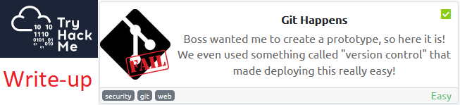
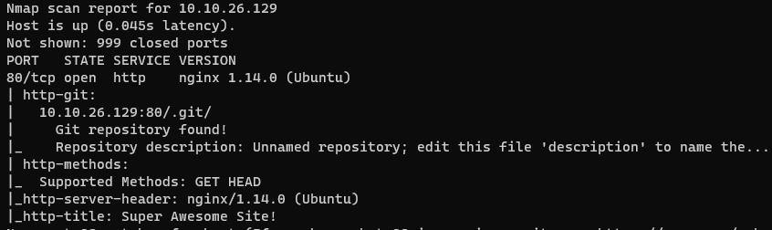
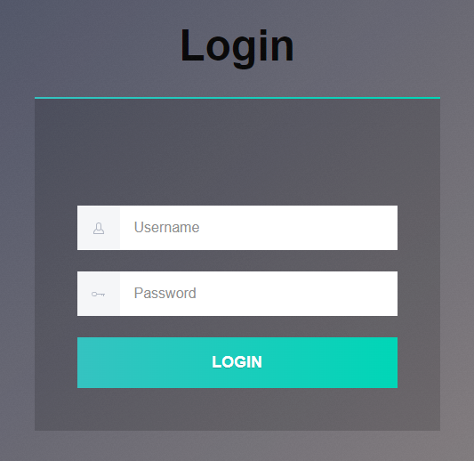
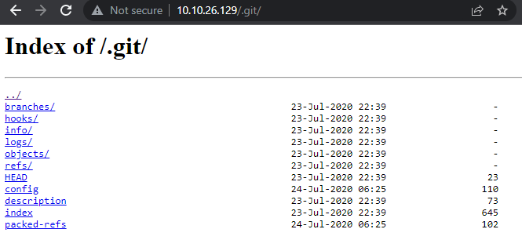
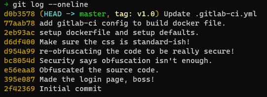
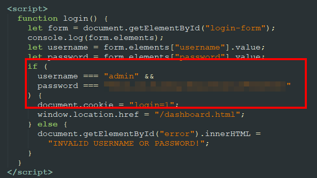

# Write-up: Git Happens @ TryHackMe



This write-up for the room *Git Happens* is part of my walk-through series for [TryHackMe](https://tryhackme.com).

Lab-Link: <https://tryhackme.com/room/githappens>  
Room type: Free
Difficulty: Easy

## Steps

### Basic enumeration

I start the lab with a nmap scan to find open ports on the machine.

```
nmap -nv -Pn -sC -sV -O -T4 -oA nmap 10.10.26.129
```

The options I use are the following:

| Option | Meaning | Reasoning |
| -- | -- | -- |
| -n | No DNS resolution | Makes no sense in the lab and slows down |
| -v | Verbose | Print open ports as soon as they are found |
| -Pn | No ping scan | In the lab, I assume the target is online | 
| -sC | Use default set of scripts | Note: This includes some intrusive scans, on a CTF box this is fine, in a real-world scenario using `--script=safe` is preferred |
| -sV | Version detection | Attempt to enumerate the versions for services found | 
| -O | OS detection | |
| -T4 | Use aggressive timing | Another option that is fine in CTF environments but can cause issues in the real world |
| -oA | Output all formats | I'd like to have all formats stored: nmap, xml and grepable |

Without any argument specifying the ports, nmap scans the 1000 most common ports. If you want to find out more, look at the file `/usr`/share/nmap/nmap-services`. 

The result comes back showing just one port open, a web server on port 80. Much more interesting, the script http-git shows that there is a git repository in the web root:



The web page is just a login screen:



It also contains some obfuscated JavaScript which I ignore for now. Nmap showed that the web root appears to be a git repository which is much juicier.

---

### Getting the repository

First I verify that the directory is indeed a git repository by opening it in the browser:



The next step is to download the full repository. Directory listing is on so I can use the trusty `wget` for the job:

```
wget --mirror http://10.10.26.129/.git/
```

Having the repository local I can now use normal git tooling to investigate further. First I look at the commits made in the repository (bottom is oldest):



Three commit messages catch the eye:

- d954a99 re-obfuscating the code to be really secure!
- bc8054d Security says obfuscation isn't enough.
- e56eaa8 Obfuscated the source code

The first of these three commits tried to hide something, the latter ones appear to improve upon this hiding in the name of security. I think about the nasty-looking obfuscated JavaScript block on the page...

---

### Going down the history

I want to look at the commit previous to the first of the hiding commits, which made the login page:

- 395e087 Made the login page, boss!

I check out this commit to see the files at that point in time. My local working copy has some inconsistencies so I use `--force` to ignore these. 

```
git checkout 395e087 --force
```



I submit the password and the room is solved. 
