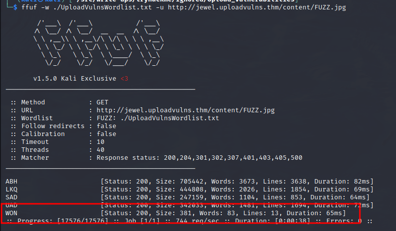

# Write-up: Upload Vulnerabilities @ TryHackMe


This write-up for the challenge task of room *Upload Vulnerabilities* is part of my walk-through series for [TryHackMe](https://tryhackme.com).

Lab-Link: <https://tryhackme.com/room/uploadvulns>  
**Room type**: Subscription only
**Difficulty**: Easy

## Lab description


## Steps

The web application is a slide set of images and it allows upload of own images as well.


### Detect content

The page itself does not reveal anything too interesting. I start with fuzzing to see if I can find more content:

```
ffuf -w /usr/share/wordlists/dirb/big.txt -u http://jewel.uploadvulns.thm/FUZZ
```


Sure enough, some more directories are found. A quick look in the CSS shows that the rotating background images are taken from the `/content/` directory. The `/admin/` directory shows a note that modules can be activated here.


The other directories do not show anything interesting.

---

### Detect technologies used

My next step is to find out what technology is used for the page to see what type of modules they might refer to. For this, I check the page with Wappalyzer:


It shows as a `node.js` application running on the `Express` framework.

---

#### Find content in subdirectories

I check the subdirectories found for additional content. The naming pattern in the wordlist provided matches the naming scheme of the images, so I check the `/content/` directory with that list too.

```
ffuf -w ./UploadVulnsWordlist.txt -u http://jewel.uploadvulns.thm/content/FUZZ.jpg
```


Sure enough, it finds the four images used as backgrounds. Nothing else shows up in the scans.

---

### Obtain script for a reverse shell

I know that the application is a Node.js application, so I get a reverse shell for that from [PayloadsAllTheThings](https://github.com/swisskyrepo/PayloadsAllTheThings/blob/master/Methodology%20and%20Resources/Reverse%20Shell%20Cheatsheet.md#nodejs) and change the IP/port to match mine:


---

#### Upload shell

I try to upload the script, but it gets blocked by the application. However, it is a message triggered by JavaScript, so I use Burp history to check the script files that got loaded.

In `/assets/js/upload.js` I find the culprit, client-side validation code:


To intercept JavaScript files I need to change the proxy options to intercept JS files, as Burp Proxy does not intercept them by default:


After removing the `^.js$` condition I reload the page with Ctrl-F5 to force a complete refresh. 

When the `upload.js` request is intercepted, I instruct Burp to intercept its response (RMB in request and select `Do Intercept->Response to this request`) and delete the lines marked above.

I attempt to re-upload, but it still fails, this time by a validation done on the server side.

In an ideal world, the server should perform all validations the client does. After all, client-side validations are there just for usability. Security can only be provided by server-side validations.

However, I assume that the world is not ideal and the server performs other validations. I change the file extension to `jpg` and retry the upload. This time, it is successful.

---

### Find uploaded shell

The file I just uploaded is not to be found with its known name in any of the directories. I re-run fuzzing of the `/contents/` directory with the wordlist provided.

This time, I find an additional file there:



### Get a reverse shell

On the `/admin/` page I can activate modules in the `/modules/` directory and the server should enforce that it does not accept any other location 

The file I just uploaded is located in `/content/`. But perhaps there is no validation in place that prevents path traversal.

I start a listener on my machine with `nc -nvlp 8888` and activate the module by its relative path: `../content/WON.jpg`

The shell I receive shows that the application runs as root. Therefore no privilege escalation is required and I can obtain the flag straight away:


